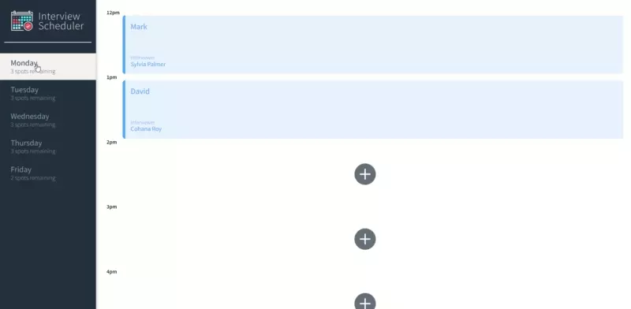
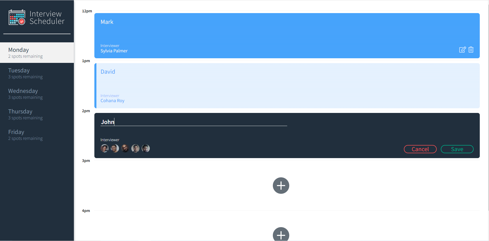

# Interview Scheduler

Interview Scheduler is a simple, dynamic single-page application that uses several hooks such as (useState, and useEffect). The application communicates with the SQL database by using Axios to fetch all information.

## Final application

 

## Getting Started

1. Clone the repository onto your local device.
2. Install dependencies using the `npm install` command.
3. Start the web server using the `npm start` command.

## Running Webpack Development Server

```sh
npm start
```

## Running Jest Test Framework

```sh
npm test
```

## Running Storybook Visual Testbed

```sh
npm run storybook
```

## Dependencies

- "axios": "^0.25.0",
- "classnames": "^2.2.6",
- "normalize.css": "^8.0.1",
- "react": "^16.9.0",
- "react-dom": "^16.9.0",
- "react-scripts": "3.0.0"
